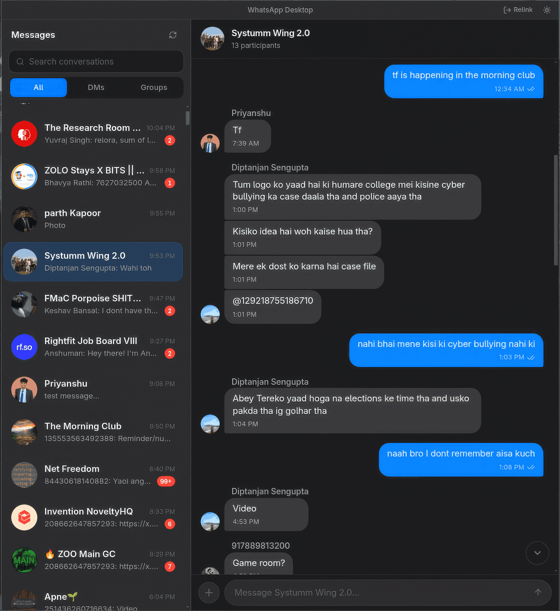

# WhatsZapp

**Your WhatsApp — rebuilt for humans, and the AI you actually picked.**

WhatsZapp is an **AI-native** desktop client for Linux and Windows. Every message lands in a local SQLite database your scripts, agents, and tools can actually use — without Meta's chatbot camping in your inbox.



---

## Why WhatsZapp?

### Linux users got the browser-tab treatment
Meta ships a proper app for Windows and Mac. On Linux? Another hungry Chrome tab that forgets you exist, can't live in the tray, and eats RAM like it's training a model. WhatsZapp is a real desktop app — fast startup, dark mode that follows your system, and a window that feels like it belongs on your machine.

### Meta stuffed AI where your chats should be
There's a bot in your inbox now. Suggested replies. "Chat with AI" banners. Stuff you never installed and can't turn off. WhatsZapp has **zero** of that. When you want AI, you'll bring your own — on your terms, with your keys, reading *your* local database.

### Your messages shouldn't be trapped in an app
Want to search every group chat from last month? Pipe unread counts into a script? Let an agent draft a reply? Official WhatsApp says no. WhatsZapp stores everything in plain SQLite so the fun part — automating, filtering, building — is actually possible. (Programmatic send, webhooks, and CLI replies are on the way.)

### Backups you can hold in your hand
The official desktop app doesn't give you a file you can copy. WhatsZapp does: one SQLite database you can back up, encrypt, sync to your NAS, or email to Future You. See [Data & privacy](#data--privacy).

---

## What you get today

**Looks like iMessage, not a browser tab** — blue sent bubbles, a proper split inbox, and scrolling that doesn't fight you.

**Filters that make sense** — All, DMs, or Groups, plus search when you need to find *that* conversation.

**Names, not mystery numbers** — resolves contacts properly; if WhatsApp only gives a push name, you'll still know who it is.

**Faces in group chats** — every group message shows who sent it, with avatar and name.

**Unread counts that behave** — badge clears when you open a chat; only ticks up on new messages, not during a background sync.

**Themes** — Dark, Light, or follow whatever your OS is doing.

**Your data, on your disk** — every message in local SQLite (WAL mode, fast sync). Agents and scripts can read it today; more ways to *act* on it are coming.

**One-tap relink** — new phone or session expired? Hit Relink, scan QR, you're back.

---

## Tech stack

| Layer | Technology |
|-------|-----------|
| Shell | Electron 33 (frameless on Linux) |
| UI framework | React 19 + Vite |
| Component library | chatcn (macOS Messages style) |
| Styling | Tailwind CSS v3 |
| WhatsApp protocol | [Baileys](https://github.com/WhiskeySockets/Baileys) 6.x (main process only) |
| Database | better-sqlite3 (SQLite WAL) |
| IPC | contextBridge + typed channels — renderer never touches Node directly |

---

## Installation

### Download a pre-built release

Head to the [**Releases**](https://github.com/laxman-patel/whatsapp-linux/releases) page and grab:

| Platform | File |
|----------|------|
| Linux (x86_64) | `WhatsZapp-*-linux-x64.AppImage` |
| Windows (x64) | `WhatsZapp-*-windows-setup.exe` |

**Linux — AppImage:**
```bash
chmod +x WhatsZapp-*-linux-x64.AppImage
./WhatsZapp-*-linux-x64.AppImage
```

> If you get a FUSE error: `sudo pacman -S fuse2` (Arch) or `sudo apt install libfuse2` (Ubuntu/Debian).

**Windows — installer:**
Run the `.exe` and follow the prompts. Windows Defender SmartScreen may warn on first run (unsigned binary) — click *More info → Run anyway*.

---

## Build from source

### Prerequisites

- Node.js 20+
- Linux or Windows (macOS works for development but AppImage targets Linux)

```bash
git clone https://github.com/laxman-patel/whatsapp-linux
cd whatsapp-linux
npm install         # also rebuilds better-sqlite3 for Electron via postinstall
```

### Development

```bash
npm run dev
```

Launches Vite dev server + Electron with hot-reload. On first launch, scan the QR code from **WhatsApp → Settings → Linked Devices → Link a device**.

### Production build

```bash
npm run build       # outputs to release/<version>/
```

Produces an AppImage on Linux and an NSIS installer on Windows.

### Releases (CI/CD)

Push a version tag to trigger builds for Linux and Windows:

```bash
git tag v0.2.0
git push origin v0.2.0
```

GitHub Actions uploads the AppImage and Windows installer to the **Releases** tab automatically.

---

## Data & privacy

All data stays **local**:

| Path | Contents |
|------|----------|
| `~/.config/whatsapp-desktop/baileys-auth/` | WhatsApp session keys (Linux) |
| `~/.config/whatsapp-desktop/whatsapp.db` | Messages, chats, contacts (SQLite) |
| `~/.config/whatsapp-desktop/avatars/` | Cached profile pictures |

On Windows, the same folder name is used under `%APPDATA%\whatsapp-desktop\`.

Nothing is transmitted to any server other than WhatsApp's own infrastructure.

---

## Project structure

```
electron/
  main/
    baileys/        WhatsApp socket, avatar fetcher, contact aliases
    db/             SQLite schema, migrations, repositories
    index.ts        Electron app entry, protocol registration
    ipc.ts          IPC handler registration
    sync-progress.ts Sync state machine + broadcaster

src/
  components/       React UI components
    ui/chat/        chatcn message/sidebar/header components
  hooks/            useChats, useMessages, useSyncProgress
  lib/adapters/     Baileys → chatcn data mappers
  shared/           IPC types shared between main & renderer
```

---

## Roadmap

### AI & automation
- [ ] **Bring-your-own AI** — plug in local models or your API of choice (not Meta's)
- [ ] **Agent API** — local HTTP / MCP endpoint so agents can read and act on your inbox
- [ ] **Smart inbox** — priority contacts, custom filters, rules
- [ ] **Programmatic send** — send messages from scripts or your stack
- [ ] **Webhooks** — fire events when messages arrive
- [ ] **Reply-from-CLI** — one-liner replies from the terminal

### Messaging polish
- [ ] **Media** — download and render images, video, audio, documents
- [ ] **Send media** — attach and send files from the composer
- [ ] **Notifications** — OS-level notifications for new messages
- [ ] **Read receipts** — mark messages as read via Baileys
- [ ] **Tray icon** — minimize to system tray, badge count
- [ ] **Message search** — full-text search across SQLite
- [ ] **Export** — one-click JSON/CSV export per chat

---

## Disclaimer

WhatsZapp is **not** affiliated with or endorsed by Meta or WhatsApp. It uses the unofficial [Baileys](https://github.com/WhiskeySockets/Baileys) library, which reverse-engineers the WhatsApp Web protocol. Using unofficial clients **may violate WhatsApp's Terms of Service** and could result in your account being temporarily or permanently banned. Use at your own risk.

---

## License

MIT — see [LICENSE](LICENSE).

Application code © 2025 Laxman. Baileys is separately licensed under its own terms.
